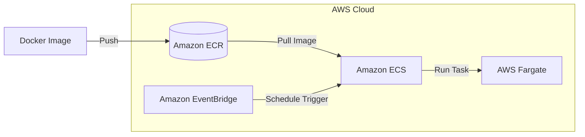

# Senate Financial Disclosure Scraper

A Python-based web scraper that automatically retrieves and processes financial disclosure reports from the U.S. Senate website, with email notification capabilities.

## Features

- Automated navigation and form submission on the Senate financial disclosure website
- Extraction of transaction data from periodic transaction reports (PTRs)
- Email notifications for successful runs and errors
- JSON export of scraped data
- Configurable headless browser operation
- Automated report attachment to notification emails
- Docker support for containerized deployment
- AWS cloud deployment options with ECS, Fargate, and EventBridge scheduling

## Prerequisites

- Python 3.8+
- Gmail account (for notifications)
- Docker (optional, for containerized deployment)
- AWS CLI (optional, for cloud deployment)

## Installation

1. Clone the repository:
```bash
git clone https://github.com/avoro/senate-efd-scraper.git
cd senate-disclosure-scraper
```

2. Install required packages:
```bash
source venv/bin/activate
```

3. Set up environment variables by creating a `.env` file in the project root:
```plaintext
GMAIL_EMAIL=your.email@gmail.com
GMAIL_PASSWORD=your-app-specific-password
```

Note: For Gmail, you'll need to use an App Password rather than your regular password.

## Usage

Run the scraper:
```bash
python src/senate_scraper.py
```

The scraper will:
1. Navigate to the Senate Financial Disclosures website
2. Accept the agreement
3. Search for today's periodic transaction reports
4. Extract and process any found reports
5. Save the data to a JSON file
6. Send an email notification with the report attached

## Email Notifications

The system sends three types of email notifications:
1. Success notifications with the JSON report attached
2. "No Reports" notifications when no new reports are found
3. Error notifications if something goes wrong during execution

## Configuration Options

In `senate_scraper.py`:
- `TIMEOUT`: Configure wait times for page elements (default: 10 seconds)
- `headless`: Set to True/False for headless browser operation

In `email_client.py`:
- `smtp_server`: SMTP server address (default: smtp.gmail.com)
- `smtp_port`: SMTP port (default: 587)

## Docker

### Prerequisites
- Docker Desktop installed and running
- Understanding of your system architecture (e.g., ARM64 for M1/M2 Macs, AMD64/x86_64 for Intel/AMD)

### Building the Docker Image

The Dockerfile is configured to use Selenium with Chrome in a containerized environment.

#### For Intel/AMD (x86_64) systems:
```bash
docker build -t senate-scraper .
```

#### For Apple Silicon (M1/M2) Macs:
```bash
build --platform linux/amd64 -t senate-scraper .
```

## AWS

The architecture enables a fully automated, serverless deployment of the scraper with robust scheduling capabilities and minimal maintenance overhead.



### 1. Elastic Container Registry
- Create a repository to store your Docker image
- The repository will provide a secure location to store and distribute your container images
- Your ECS tasks will pull the image from this repository when running

### 2. Elastic Container Service with Fargate
- Create an ECS cluster to manage your containerized application
- Define a task definition
- Fargate provides serverless compute for your containers, eliminating the need to manage EC2 instances

### 3. EventBridge 
- Create a rule with a cron expression to schedule the scraper
  - Example schedule: Daily at specific times
- The rule triggers the ECS task in Fargate
- Enables automatic execution without manual intervention

## Security Notes

1. Never commit your `.env` file to version control
2. Use App Passwords for Gmail authentication
3. Use AWS Secrets Manager or Parameter Store for sensitive credentials in cloud deployment
